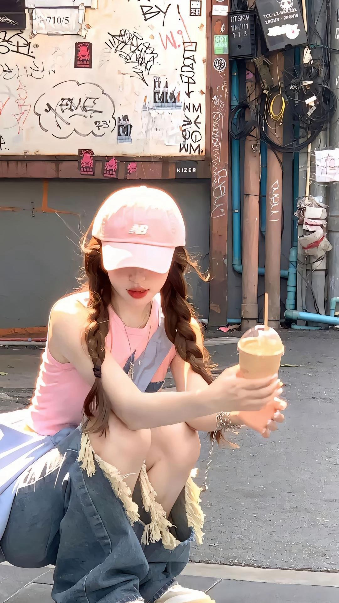
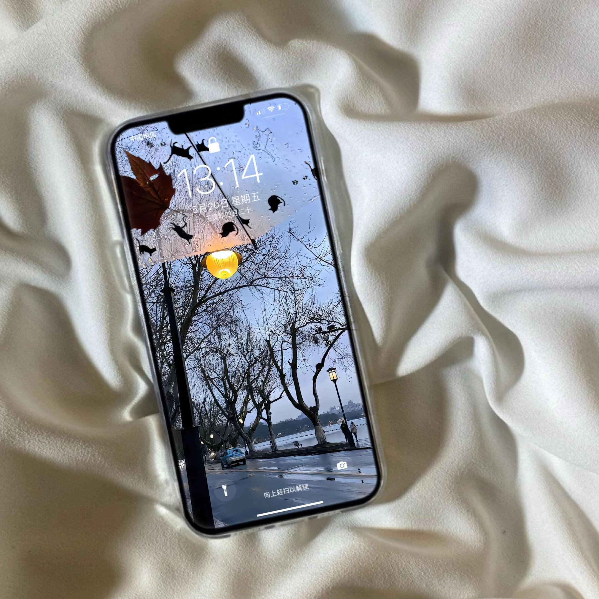

# 背景图片库 🎨

## 项目简介

这是一个精心收集的背景图片资源库，包含多张高质量的背景图片，适用于各种设计和开发项目。

## 📁 项目内容

本项目包含 **13张** 高质量背景图片：

| 文件名 | 大小 | 描述 |
|--------|------|------|
| background_01.jpg | 136KB | 背景图片 1 |
| background_02.jpg | 285KB | 背景图片 2 |
| background_03.jpg | 254KB | 背景图片 3 |
| background_04.jpg | 233KB | 背景图片 4 |
| background_05.jpg | 155KB | 背景图片 5 |
| background_06.jpg | 341KB | 背景图片 6 |
| background_07.jpg | 763KB | 背景图片 7 |
| background_08.jpg | 638KB | 背景图片 8 |
| background_09.jpg | 164KB | 背景图片 9 |
| background_10.jpg | 220KB | 背景图片 10 |
| background_12.jpg | 147KB | 背景图片 12 |
| background_13.jpg | 80KB | 背景图片 13 |
| background_14.jpg | 203KB | 背景图片 14 |

## 🖼️ 图片预览

以下是部分精选背景图片的预览：

### 样例图片展示

<div align="center">


*background_01.jpg*


*background_03.jpg*


*background_06.jpg*


*background_08.jpg*

</div>

> 💡 **提示**: 更多高质量背景图片请查看项目文件夹中的其他图片文件。

## 🚀 使用方法

### 克隆项目
```bash
git clone git@github.com:zhrgithub/background-images.git
```

### 直接下载
您可以直接下载所需的背景图片，或者下载整个项目的压缩包。

## 📖 适用场景

这些背景图片可以用于：

- 🌐 网站背景设计
- 📱 移动应用界面设计
- 🎨 平面设计项目
- 📊 演示文稿背景
- 🎮 游戏场景设计
- 📸 摄影后期处理

## 📋 技术规格

- **格式**: JPEG (.jpg)
- **文件大小**: 80KB - 763KB
- **总数量**: 13张图片
- **质量**: 高清背景图片

## 🔧 注意事项

1. 所有图片均为JPEG格式，具有良好的压缩比和画质平衡
2. 图片大小适中，适合网络传输和使用
3. 建议在使用前检查图片的版权和使用许可

## 📞 联系方式

如有任何问题或建议，请通过GitHub Issues联系。

## 📄 许可证

请在使用前确认图片的使用许可和版权信息。

---

**⭐ 如果这个项目对您有帮助，请给个Star支持一下！** 